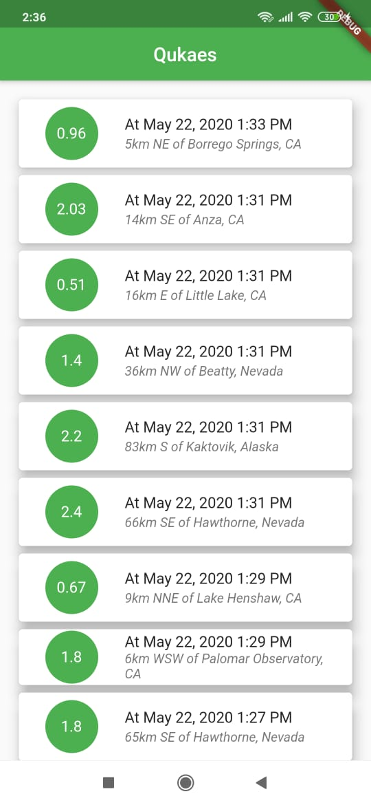
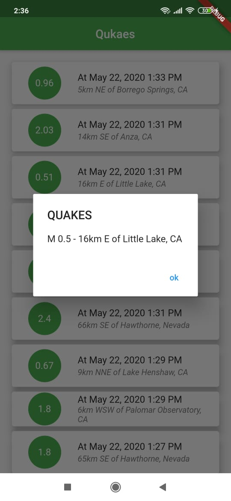

# quake_app

A new Flutter project in which a record of recent EarthQuakes is viewed in a listview. By tapping on the list the magnitude of the EarthQuake is displayed in form a alert dialog. A http call is made to the json api to get the earthquake information and only required information is displayed by parsing through the api.

## screenshots
|
## Getting Started

This project is a starting point for a Flutter application.

A few resources to get you started if this is your first Flutter project:

- [Lab: Write your first Flutter app](https://flutter.dev/docs/get-started/codelab)
- [Cookbook: Useful Flutter samples](https://flutter.dev/docs/cookbook)

For help getting started with Flutter, view our
[online documentation](https://flutter.dev/docs), which offers tutorials,
samples, guidance on mobile development, and a full API reference.
